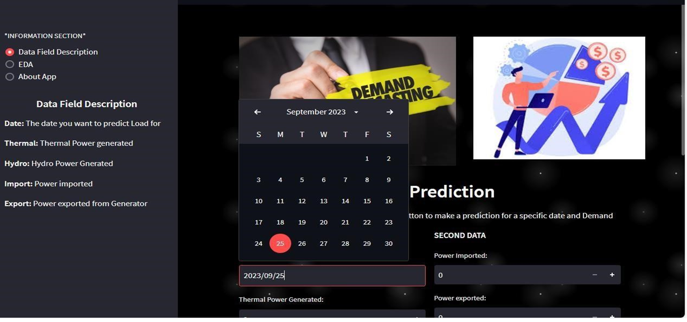
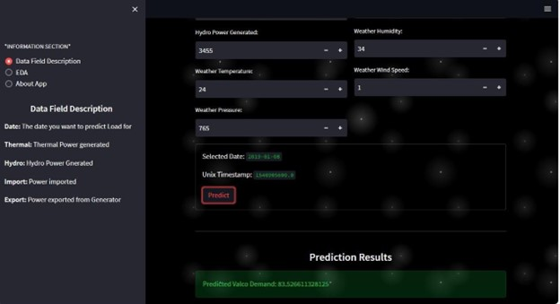
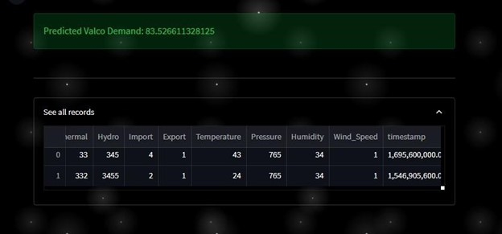
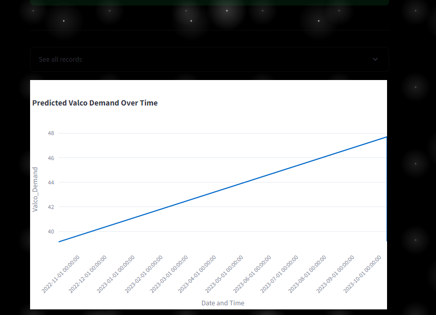

# Web_App_For_Ghana_Valco_Demand

## Overview / Introduction  
As the population and industrializing are increasing, the corresponding energy demand is increasing year by year exponentially. Electricity is the central nervous system of our modern existence commodities. It is also critical to any country's national security, social and economic prosperity. As a result, the security and sustainability of energy sources, as well as the continuity of generation, are critical problems, and electrical load forecasting may be quite useful in this regard. Load forecasting (LF) is the anticipation and prediction of demand load that is computed using a systematic approach to alter future expectations based on existing characteristics and information to anticipate future demands and system requirements. Precise load prediction or forecasting can help energy and power providers ensure the security and continuity of the power supply with no (or minor) disruptions. In addition, because electrical power is difficult to store, scheduling and limiting energy waste are important. Electrical load forecasting may be used to manage generation capacity, schedule maintenance and outages, grid and transmission management, peak reduction, and reserve capacity management.  Furthermore, it is critical for market evaluation and assessment of power trade capacity and interconnection capabilities, as well as preparing reserve to overcome any power deficits for any VALCO, or the Volta Aluminium Company Limited, holds a storied place in Ghana's industrial history. Established in the early 1960s, VALCO emerged as a symbol of the nation's aspirations for industrialization and economic diversification. Founded through a partnership between the Ghanaian government and American aluminum giants Kaiser Aluminum and Reynolds Metals Company. The Volta Aluminum Company (VALCO) in Ghana relies on hydroelectric power from the Akosombo Dam for its electricity. This dam, which is located on the Volta River, is the largest hydroelectric power plant in West Africa and one of the largest in Africa. The Akosombo Dam supplies VALCO with about 80% of its power needs. The remaining 20% of its power needs are met by the Aboadze Thermal Power Plant, which is located in Takoradi. Together, these two power sources ensure that VALCO has a reliable and sustainable source of energy  

This repository contains a web App with a user-friendly interface, which I have embed my ML model from Load Forecasting Project Project. 

### Manual Setup

For manual installation, you need to have [`Python3`](https://www.python.org/) on your system. Then you can clone this repo and being at the repo's `root :: friendly_web_interface_for_ML_models> ...`  follow the steps below:

- Windows:
        
        python -m venv venv; venv\Scripts\activate; python -m pip install -q --upgrade pip; python -m pip install -qr requirements.txt  

- Linux & MacOs:
        
        python3 -m venv venv; source venv/bin/activate; python -m pip install -q --upgrade pip; python -m pip install -qr requirements.txt  

    **NB:** For MacOs users, please install `Xcode` if you have an issue.

- Run the demo apps (being at the repository root):

        streamlit run load1.py

- You can access the hosted app on Huggingface spaces at the link below :
        
    [click here](https://huggingface.co/spaces/Gyimah3/Valco-Demand-App)
    
    
    
    
 ## Screenshots

<table>
    <tr>
        <th>Interface and sidebar</th>
        <th>Input Interface and SideBar</th>
        <th>prediction and record</th>
        <th>After Prediction trend</th>
    </tr>
    <tr>
        <td></td>
        <td></td>
        <td></td>
        <td></td>
    </tr>
</table>

    
  ## Authors:
[Gyimah Gideon](https://www.linkedin.com/in/gideon-gyimah-08268b243/)  

[ Antwi Augustine](https://wa.link/e7w16w)

[ Damba Eric](https://wa.link/c648pg)

   
